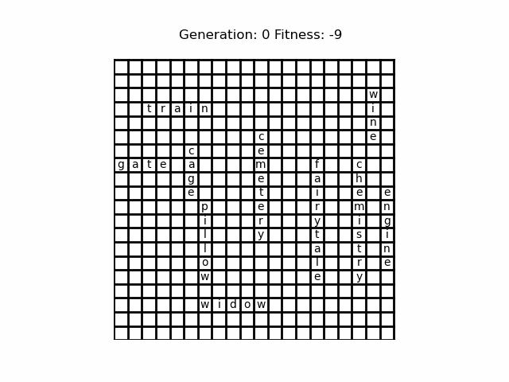

# ga_crossword
by Sadreddinov Dzhavid

Genetic algorithm for crossword generation.

Example on 10 words with grid_size=20:


Usage:
1. Save words one in a line into file 
2. Run ``` python main.py path-to-file ```

Notes:
- it is not guaranteed to converge as it can stuck in local minima i.e. get such crossword that it must heavily mutated to be possible to get built
- the major reason is the situation when the crossword started building close to the corner and whole group of words must be shifted
- the minor reason is when a bunch of words should be connected in other places to leave space for other word(s) to be put on their place (but it is mostly solved by mutations (random swaps))
- to eliminate this problem the restart interval is set, you can adjust it to your grid size and number of words.
- for large enough grid size it is highly probable to generate crossword

Results:
Time for generating crossword with fixed grid_size=20 varying number of words:
| #words | median, s | mean, s | std, s |
|--------|-----------|---------|--------|
| 5 | 1.24| 3.08 | 3.69 |
| 6 | 1.92| 2.68 | 1.97 |
| 7 | 2.23| 4.94 | 6.10 |
| 8 | 7.21| 16.18 | 25.33 |
| 9 | 13.68| 27.00 | 34.59 |
| 10 | 14.21| 47.63 | 107.49 |
| 11 | 18.04| 31.56 | 33.54 |
| 12 | 18.66| 36.62 | 48.88 |
| 13 | 26.38| 78.84 | 96.96 |
| 14 | 38.75| 69.20 | 56.78 |
| 15 | 191.03| 258.13 | 300.80 |
| 16 | 82.25| 244.90 | 455.74 |

